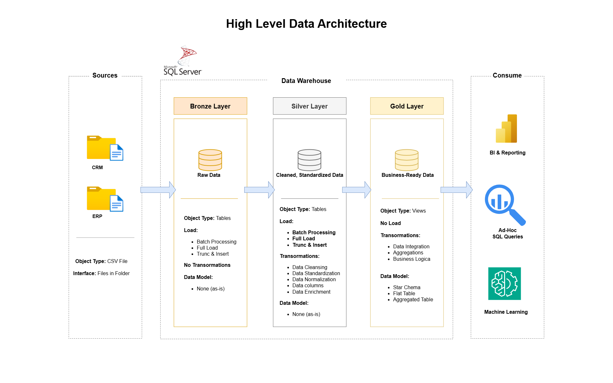
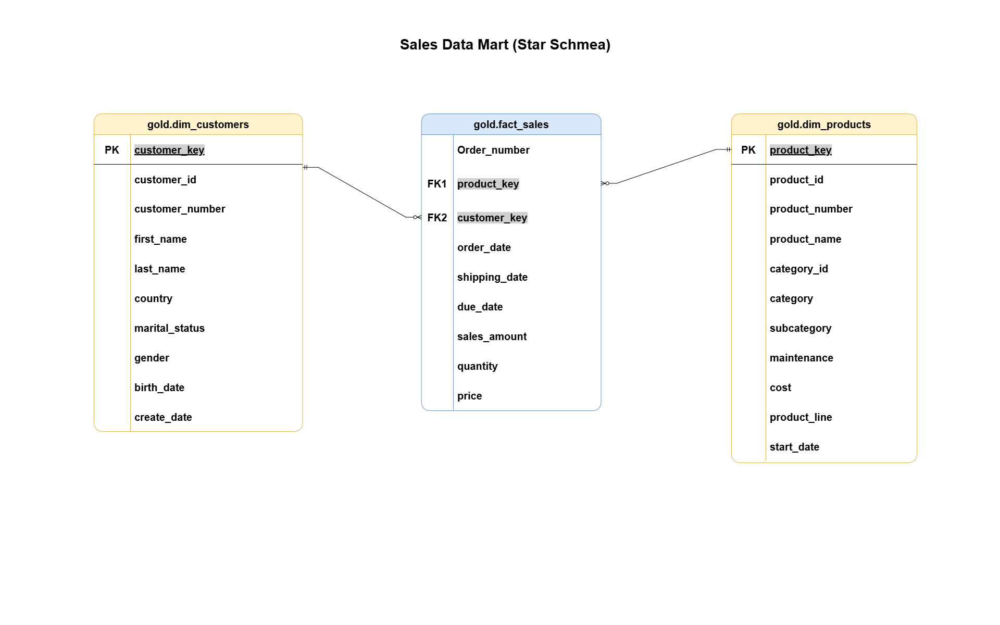

# SQL Data Warehouse Project

This project demonstrates the comprehensive data warehousing and analytics solution, from building a data warehouse to generating actionable insights. 
This portfolio project highlights the industry best practices in data engineering and analytics.

The goal is to simulate how raw operational data is ingested, cleaned, structured, and made ready for business intelligence and decision-making — a critical process in any modern data-driven organization.

---

## Building the Data Warehouse (Data Engineering)

### Objective
Develop a modern data warehouse using SQL Server to consolidate sales data, enabling analytical reporting and informed decision-making.

#### Specifications
- **Data Sources**: Import data from two source systems (ERP and CRM) provided as CSV files.
- **Data Quality**: Cleanse and resolve data quality issues prior to analysis.
- **Integration**: Combine both sources into a single, user-friendly data model designed for analytical queries.
- **Scope**: Focus on the latest dataset only; historization of data is not required.
- **Documentation**: Provide clear documentation of the data model to support both business stakeholders and analytics teams.

---

## Project Overview

This project involves:

1. **Data Architecture**: Designing a Modern Data Warehouse Using Medallion Architecture **Bronze**, **Silver**, and **Gold** layers.
2. **ETL Pipelines**: Extracting, transforming, and loading data from source systems into the warehouse.
3. **Data Modeling**: Developing fact and dimension tables optimized for analytical queries.
4. **Analytics & Reporting**: Creating SQL-based reports and dashboards for actionable insights.

The data architecture for this project follows Medallion Architecture **Bronze**, **Silver**, and **Gold** layers:

1. **Bronze Layer**: Stores raw data as-is from the source systems. Data is ingested from CSV Files into SQL Server Database.
2. **Silver Layer**: This layer includes data cleansing, standardization, and normalization processes to prepare data for analysis.
3. **Gold Layer**: Houses business-ready data modeled into a star schema required for reporting and analytics.

---
## Repository Structure
```
sql-data-warehouse-project/
│
├── datasets/                           # Raw datasets folder
│   ├── source_crm                      # Conatins files for the project CRM data
│   ├── source_erp                      # Contains files for the project ERP data
|
├── docs/                               # Project documentation and architecture details
│   ├── Data_Architecture.png           # Project's architecture Diagram
│   ├── Data_Flow.png                   # Data flow diagram
│   ├── Data_Integration.png            # Data Integration Diagram (How tables are related)
│   ├── Data_Model.png                  # Data model Diagram (star schema)
│   ├── data_catalog.md                 # Catalog of gold layer tables, including field descriptions and metadata
│
├── scripts/                            # SQL scripts for ETL and transformations
│   ├── bronze/                         # Scripts for extracting and loading raw data
│   ├── silver/                         # Scripts for cleaning and transforming data
│   ├── gold/                           # Scripts for creating analytical models
│
├── tests/                              # Quality check script files
│
├── README.md                           # Project overview and instructions
├── LICENSE                             # License information for the repository

```
---
## How to use

1. Clone this repository:

   ```bash
   git clone https://github.com/dixitdosibhatla/sql-data-warehouse-project.git
2. Open the SQL scripts in SQL Server Management Studio.
3. Execute the scripts in the following order:
    - Create database and tables
    - Load sample data
    - Run ETL transformation scripts
4. Query the Data Warehouse:
    - Use SELECT queries on fact and dimension tables to perform sales analysis, time-based trends, and customer segmentation.

